# Tetris Project UML Class Diagram

## Complete Class Diagram (Mermaid)

```mermaid
classDiagram
    direction TB

    %% ==================== MAIN ====================
    class Main {
        -Stage primaryStage
        +start(Stage primaryStage)
        +main(String[] args)
        -showMainMenu()
        -startSinglePlayer()
        -startMultiplayer()
    }

    %% ==================== INTERFACES ====================
    class Board {
        <<interface>>
        +moveBrickDown() boolean
        +moveBrickLeft() boolean
        +moveBrickRight() boolean
        +rotateLeftBrick() boolean
        +createNewBrick() boolean
        +getBoardMatrix() int[][]
        +getViewData() ViewData
        +mergeBrickToBackground()
        +clearRows() ClearRow
        +getScore() Score
        +newGame()
        +holdCurrentPiece() boolean
        +getHeldPiece() Optional~Tetromino~
    }

    class Tetromino {
        <<interface>>
        +getShapeMatrix() List~int[][]~
    }

    class TetrominoGenerator {
        <<interface>>
        +getTetromino() Tetromino
        +getNextTetromino() Tetromino
    }

    class InputEventListener {
        <<interface>>
        +onDownEvent(MoveEvent) DownData
        +onLeftEvent(MoveEvent) ViewData
        +onRightEvent(MoveEvent) ViewData
        +onRotateEvent(MoveEvent) ViewData
        +onHoldEvent(MoveEvent) ViewData
        +createNewGame()
    }

    class DifficultyStrategy {
        <<interface>>
        +getDropSpeed() int
        +getScoreMultiplier() int
        +getDifficultyName() String
    }

    class ScoreObserver {
        <<interface>>
        +onScoreChanged(int, int)
        +onLevelChanged(int)
        +onComboAchieved(int)
    }

    %% ==================== CORE CLASSES ====================
    class TetrisBoard {
        -int[][] board
        -Tetromino currentTetromino
        -Tetromino nextTetromino
        -TetrominoGenerator generator
        -TetrominoRotator rotator
        -CollisionDetector collisionDetector
        -HoldPieceManager holdManager
        -GhostPieceCalculator ghostCalculator
        -Score score
        -int currentX
        -int currentY
        +moveBrickDown() boolean
        +moveBrickLeft() boolean
        +moveBrickRight() boolean
        +rotateLeftBrick() boolean
        +createNewBrick() boolean
        +holdCurrentPiece() boolean
        +clearRows() ClearRow
        +getGhostY() int
    }

    class Score {
        -IntegerProperty score
        -int basePoints
        +addClearedLines(int)
        +setScore(int)
        +scoreProperty() IntegerProperty
        +getValue() int
    }

    class GameState {
        -static GameState instance
        -boolean paused
        -boolean gameOver
        -int highScore
        -DifficultyStrategy difficulty
        +getInstance() GameState
        +isPaused() boolean
        +isGameOver() boolean
        +reset()
    }

    class ComboManager {
        -int comboCount
        -int maxCombo
        +incrementCombo()
        +resetCombo()
        +getComboCount() int
        +getComboMultiplier() double
    }

    class LevelManager {
        -int currentLevel
        -int totalLinesCleared
        -int linesUntilNextLevel
        +addClearedLines(int)
        +getCurrentLevel() int
        +getDropSpeed() int
    }

    class HoldPieceManager {
        -Tetromino heldPiece
        -boolean canHold
        +holdPiece(Tetromino) Optional~Tetromino~
        +getHeldPiece() Optional~Tetromino~
        +resetHoldAbility()
    }

    class GhostPieceCalculator {
        +calculateGhostY(int[][], int[][], int, int) int
    }

    %% ==================== CONTROLLERS ====================
    class GameController {
        -Board board
        -GuiController guiController
        -ScoreSubject scoreSubject
        -LevelManager levelManager
        -ComboManager comboManager
        +onDownEvent(MoveEvent) DownData
        +onLeftEvent(MoveEvent) ViewData
        +onRightEvent(MoveEvent) ViewData
        +onRotateEvent(MoveEvent) ViewData
        +onHoldEvent(MoveEvent) ViewData
        +createNewGame()
    }

    class TetrominoRotator {
        +rotate(int[][]) int[][]
        +rotateClockwise(int[][]) int[][]
        +rotateCounterClockwise(int[][]) int[][]
    }

    class CollisionDetector {
        +hasCollision(int[][], int[][], int, int) boolean
        +canMoveLeft(int[][], int[][], int, int) boolean
        +canMoveRight(int[][], int[][], int, int) boolean
        +canMoveDown(int[][], int[][], int, int) boolean
        +canRotate(int[][], int[][], int, int) boolean
    }

    %% ==================== UI CLASSES ====================
    class GuiController {
        -GridPane gamePanel
        -GridPane brickPanel
        -Label scoreLabel
        -Label levelLabel
        -InputEventListener eventListener
        -BooleanProperty isPause
        -BooleanProperty isGameOver
        +initialize()
        +initGameView(int[][], ViewData)
        +refreshBrick(ViewData)
        +refreshGameBackground(int[][])
        +gameOver()
        +newGame()
    }

    class MultiplayerGuiController {
        -TetrisBoard board1
        -TetrisBoard board2
        -PlayerHealth player1Health
        -PlayerHealth player2Health
        -Timeline timeline1
        -Timeline timeline2
        +initialize()
        +handleKeyPress(KeyEvent)
        +updateBoard(int, int[][], ViewData)
        +checkGameOver()
    }

    class GameOverPanel {
        +GameOverPanel()
    }

    class NotificationPanel {
        +NotificationPanel()
    }

    class ColorPalette {
        +getColor(int) Color
        +getGhostColor(int) Color
    }

    %% ==================== PIECES ====================
    class IPiece {
        -List~int[][]~ shapeMatrix
        +getShapeMatrix() List~int[][]~
    }

    class JPiece {
        -List~int[][]~ shapeMatrix
        +getShapeMatrix() List~int[][]~
    }

    class LPiece {
        -List~int[][]~ shapeMatrix
        +getShapeMatrix() List~int[][]~
    }

    class OPiece {
        -List~int[][]~ shapeMatrix
        +getShapeMatrix() List~int[][]~
    }

    class SPiece {
        -List~int[][]~ shapeMatrix
        +getShapeMatrix() List~int[][]~
    }

    class TPiece {
        -List~int[][]~ shapeMatrix
        +getShapeMatrix() List~int[][]~
    }

    class ZPiece {
        -List~int[][]~ shapeMatrix
        +getShapeMatrix() List~int[][]~
    }

    class RandomTetrominoGenerator {
        -List~Tetromino~ bag
        -Tetromino nextTetromino
        +getTetromino() Tetromino
        +getNextTetromino() Tetromino
        -refillBag()
    }

    class TetrominoFactory {
        +createTetromino(TetrominoType) Tetromino
        +createRandomTetromino() Tetromino
    }

    class TetrominoType {
        <<enumeration>>
        I
        J
        L
        O
        S
        T
        Z
    }

    %% ==================== EVENTS ====================
    class MoveEvent {
        -EventType type
        -EventSource source
        +getType() EventType
        +getSource() EventSource
    }

    class EventType {
        <<enumeration>>
        LEFT
        RIGHT
        DOWN
        ROTATE
        HOLD
    }

    class EventSource {
        <<enumeration>>
        USER
        SYSTEM
    }

    %% ==================== MODELS ====================
    class ViewData {
        -int[][] brickData
        -int xPosition
        -int yPosition
        +getBrickData() int[][]
        +getXPosition() int
        +getYPosition() int
    }

    class DownData {
        -ViewData viewData
        -ClearRow clearRow
        -NextShapeInfo nextShape
        +getViewData() ViewData
        +getClearRow() ClearRow
        +getNextShape() NextShapeInfo
    }

    class ClearRow {
        -int rowsCleared
        -int[] clearedRowIndices
        +getRowsCleared() int
        +getClearedRowIndices() int[]
    }

    class NextShapeInfo {
        -int[][] shapeMatrix
        +getShapeMatrix() int[][]
    }

    %% ==================== MULTIPLAYER ====================
    class MultiplayerController {
        -TetrisBoard board1
        -TetrisBoard board2
        -PlayerHealth player1Health
        -PlayerHealth player2Health
        +handleInput(int, KeyCode)
        +update()
    }

    class MultiplayerGameManager {
        -List~TetrisBoard~ boards
        -List~PlayerHealth~ healths
        +startGame()
        +endGame()
        +getWinner() int
    }

    class PlayerHealth {
        -int maxHp
        -int currentHp
        +takeDamage(int)
        +heal(int)
        +getCurrentHp() int
        +getHpPercentage() double
        +isDefeated() boolean
    }

    class AttackCalculator {
        +calculateDamage(int) int
        +calculateLineSendDamage(int) int
    }

    class PlayerInputHandler {
        +handleInput(KeyCode, int) MoveEvent
    }

    %% ==================== PATTERNS ====================
    class ScoreSubject {
        -List~ScoreObserver~ observers
        -int currentScore
        -int currentLevel
        +addObserver(ScoreObserver)
        +removeObserver(ScoreObserver)
        +notifyScoreChanged(int, int)
        +notifyLevelChanged(int)
        +notifyComboAchieved(int)
    }

    class EasyDifficulty {
        +getDropSpeed() int
        +getScoreMultiplier() int
        +getDifficultyName() String
    }

    class MediumDifficulty {
        +getDropSpeed() int
        +getScoreMultiplier() int
        +getDifficultyName() String
    }

    class HardDifficulty {
        +getDropSpeed() int
        +getScoreMultiplier() int
        +getDifficultyName() String
    }

    %% ==================== UTILS ====================
    class MatrixOperations {
        +rotate90Clockwise(int[][]) int[][]
        +rotate90CounterClockwise(int[][]) int[][]
        +deepCopy(int[][]) int[][]
        +merge(int[][], int[][], int, int) int[][]
    }

    %% ==================== RELATIONSHIPS ====================
    
    %% Interface Implementations
    TetrisBoard ..|> Board : implements
    GameController ..|> InputEventListener : implements
    
    IPiece ..|> Tetromino : implements
    JPiece ..|> Tetromino : implements
    LPiece ..|> Tetromino : implements
    OPiece ..|> Tetromino : implements
    SPiece ..|> Tetromino : implements
    TPiece ..|> Tetromino : implements
    ZPiece ..|> Tetromino : implements
    
    RandomTetrominoGenerator ..|> TetrominoGenerator : implements
    
    EasyDifficulty ..|> DifficultyStrategy : implements
    MediumDifficulty ..|> DifficultyStrategy : implements
    HardDifficulty ..|> DifficultyStrategy : implements
    
    GuiController ..|> ScoreObserver : implements
    
    %% Compositions and Aggregations
    TetrisBoard *-- Score : has
    TetrisBoard *-- HoldPieceManager : has
    TetrisBoard o-- Tetromino : currentPiece
    TetrisBoard o-- TetrominoGenerator : uses
    TetrisBoard o-- CollisionDetector : uses
    TetrisBoard o-- TetrominoRotator : uses
    TetrisBoard o-- GhostPieceCalculator : uses
    
    GameController o-- Board : controls
    GameController o-- GuiController : updates
    GameController *-- ScoreSubject : has
    GameController *-- LevelManager : has
    GameController *-- ComboManager : has
    
    GuiController o-- InputEventListener : uses
    
    MultiplayerGuiController *-- TetrisBoard : board1
    MultiplayerGuiController *-- TetrisBoard : board2
    MultiplayerGuiController *-- PlayerHealth : player1Health
    MultiplayerGuiController *-- PlayerHealth : player2Health
    
    MultiplayerController o-- AttackCalculator : uses
    MultiplayerController o-- PlayerInputHandler : uses
    
    ScoreSubject o-- ScoreObserver : notifies
    
    GameState o-- DifficultyStrategy : uses
    
    MoveEvent o-- EventType : has
    MoveEvent o-- EventSource : has
    
    DownData o-- ViewData : contains
    DownData o-- ClearRow : contains
    DownData o-- NextShapeInfo : contains
    
    TetrominoFactory ..> Tetromino : creates
    TetrominoFactory ..> TetrominoType : uses
    
    Main ..> GuiController : creates
    Main ..> MultiplayerGuiController : creates
    Main ..> GameController : creates

    %% Dependencies
    CollisionDetector ..> MatrixOperations : uses
    TetrominoRotator ..> MatrixOperations : uses
```



## Package Structure

```text
com.comp2042
├── Main.java
└── tetris
    ├── collision
    │   └── CollisionDetector.java
    ├── controllers
    │   ├── GameController.java
    │   └── TetrominoRotator.java
    ├── core
    │   ├── Board.java (interface)
    │   ├── ComboManager.java
    │   ├── GameState.java (singleton)
    │   ├── GhostPieceCalculator.java
    │   ├── HoldPieceManager.java
    │   ├── LevelManager.java
    │   ├── Score.java
    │   └── TetrisBoard.java
    ├── events
    │   ├── EventSource.java (enum)
    │   ├── EventType.java (enum)
    │   ├── InputEventListener.java (interface)
    │   └── MoveEvent.java
    ├── models
    │   ├── ClearRow.java
    │   ├── DownData.java
    │   ├── NextShapeInfo.java
    │   └── ViewData.java
    ├── multiplayer
    │   ├── AttackCalculator.java
    │   ├── MultiplayerController.java
    │   ├── MultiplayerGameManager.java
    │   ├── PlayerHealth.java
    │   └── PlayerInputHandler.java
    ├── patterns
    │   ├── DifficultyStrategy.java (interface)
    │   ├── EasyDifficulty.java
    │   ├── HardDifficulty.java
    │   ├── MediumDifficulty.java
    │   ├── ScoreObserver.java (interface)
    │   └── ScoreSubject.java
    ├── pieces
    │   ├── IPiece.java
    │   ├── JPiece.java
    │   ├── LPiece.java
    │   ├── OPiece.java
    │   ├── RandomTetrominoGenerator.java
    │   ├── SPiece.java
    │   ├── TPiece.java
    │   ├── Tetromino.java (interface)
    │   ├── TetrominoFactory.java
    │   ├── TetrominoGenerator.java (interface)
    │   ├── TetrominoType.java (enum)
    │   └── ZPiece.java
    ├── ui
    │   ├── ColorPalette.java
    │   ├── GameOverPanel.java
    │   ├── GuiController.java
    │   ├── MultiplayerGuiController.java
    │   └── NotificationPanel.java
    └── utils
        └── MatrixOperations.java
```

## Design Patterns Used

| Pattern | Implementation | Purpose |
|---------|----------------|---------|
| **Strategy** | `DifficultyStrategy` + Easy/Medium/HardDifficulty | Configurable difficulty levels |
| **Observer** | `ScoreSubject` + `ScoreObserver` | UI updates on score/level changes |
| **Singleton** | `GameState` | Global game state management |
| **Factory** | `TetrominoFactory` | Tetromino piece creation |
| **MVC** | Controllers + UI + Models | Separation of concerns |
